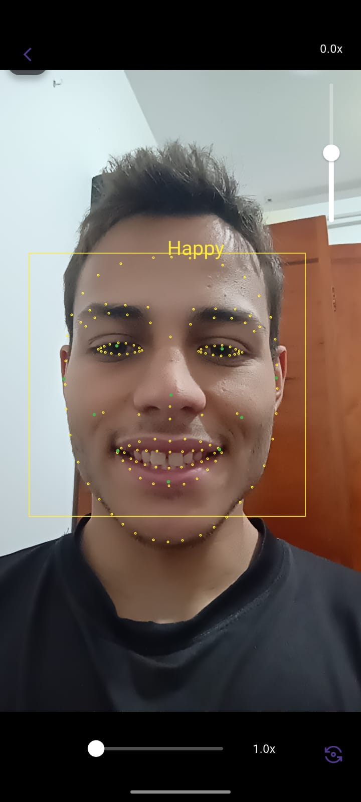
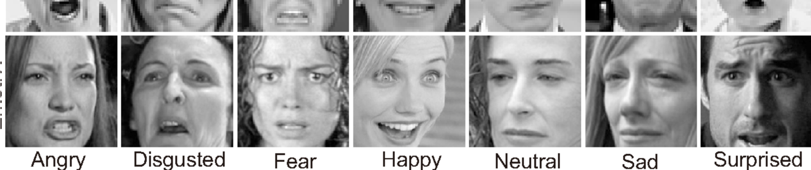

# EmotionApp

Aplicação em Flutter para reconhecimento de emoções através da imagem capturada pela câmera.

 

## Modelo

Criação do modelo feito com tensorflow e keras, utilizando a base de dados FER2013

Foi usado apenas 5 emoções, com 3171 imagens de treino para cada, sendo elas:
- Raiva
- Felicidade
- Neutro
- Triste
- Surpreso

O modelo apresentou $\approx 70\\%$ de acurácia ao final do treino.

Após converter o modelo para tflite, para ser usado em aplicativos mobile, a acurácia caiu para $\approx 62\\%$.

## Detecção Facial

A funcionalidade de detecção facial foi desenvolvida com o **ML KIT**, biblioteca de aprendizado de máquina da Google, que permite identificar rostos e pontos faciais em imagens de forma eficiente e otimizada para dispositivos móveis.

## Inferência da emoção

A imagem da câmera é recortada a partir das coordenadas adquiridas pelo ML KIT, preprocessada com redimensionamento, escala cinza e normalização e enviada ao modelo, que faz a inferência.

